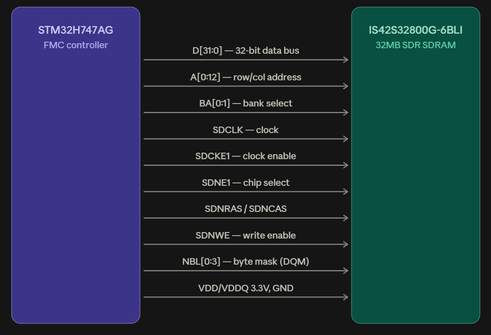

# STM32H747AG ↔ SDRAM Connection Guide (AR Glasses Board)

## 1. Why the DDR2 chip from the earlier pinout doesn't work here

The chip in the 60-ball FBGA pinout you shared earlier (the one with `ODT`,
`V_DDL`, and `RDQS` pins) is a **DDR2 SDRAM**. Those three signals are DDR2
signatures — on-die termination, a DLL delay-line supply, and the redundant
read strobe — that don't exist on single-data-rate parts.

The STM32H747AG's external memory controller (FMC) explicitly only talks to:

> "synchronous DRAM (SDRAM/Mobile LPSDR SDRAM) memories" — *STM32H747xI/G
> datasheet, §3.15, Flexible Memory Controller*

That's **SDR only**. STM32H7 has no DDR PHY, no ODT, no DLL-calibrated strobe
capture — the silicon simply cannot clock in DDR2's double-pumped, strobe-
edge-aligned data. Beyond the protocol mismatch, that DDR2 part also runs at
1.8V core / separate VDDQ+VREF, which don't match the 3.3V single-rail I/O
the FMC drives. It's a no-go on two independent counts.

## 2. Recommended replacement: ISSI IS42S32800G-6BLI

| | DDR2 chip (pictured) | **IS42S32800G-6BLI** |
|---|---|---|
| Interface | DDR2 (incompatible) | **SDR SDRAM (FMC-native)** |
| Capacity | unknown density, x8 | 256 Mbit = **32 MB**, x32 |
| Data bus | 8-bit | 32-bit (matches FMC's full width) |
| Voltage | 1.8V core | **3.3V** (matches STM32H7 I/O) |
| Speed | DDR-rate | 133 MHz SDR (~532 MB/s effective at x32) |
| Proven with this MCU | No | **Yes** — this is the exact part ST uses on the STM32H747I-DISCO reference board |

This isn't a guess — it's the SDRAM ST themselves ships wired to an
STM32H747 FMC in a shipping reference design, so the pin mapping below is
board-proven, not theoretical. 32MB gives you a comfortable frame buffer +
working-memory pool for the TAS030HDC01 display (1280×720 @ 24bpp needs
~2.7MB per frame, so this leaves plenty of headroom for double-buffering,
compositing, or sensor data).

If 32MB is more than you need and you'd rather simplify routing than
maximize capacity, see the OctoSPI alternative in §5.

## 3. Full connection table

All GPIO names below use the STM32H747AG's own FMC alternate-function
mapping (verified directly from the datasheet's pinout tables), so they're
valid regardless of which package you choose. Pin numbers are given for
**LQFP208**; TFBGA240+25 numbers are in parentheses if you're routing the
BGA variant instead.

### Data bus (D0–D31 ↔ DQ0–DQ31)

| FMC signal | MCU pin (LQFP208 / TFBGA240) | SDRAM pin |
|---|---|---|
| FMC_D0  | PD14 — 115 (P16) | DQ0 — R8 |
| FMC_D1  | PD15 — 116 (P15) | DQ1 — N7 |
| FMC_D2  | PD0  — 170 (D13) | DQ2 — R9 |
| FMC_D3  | PD1  — 171 (E12) | DQ3 — N8 |
| FMC_D4  | PE7  — 76 (U9)   | DQ4 — P9 |
| FMC_D5  | PE8  — 77 (T9)   | DQ5 — M8 |
| FMC_D6  | PE9  — 78 (P9)   | DQ6 — M7 |
| FMC_D7  | PE10 — 81 (N9)   | DQ7 — L8 |
| FMC_D8  | PE11 — 82 (P10)  | DQ8 — L2 |
| FMC_D9  | PE12 — 83 (R10)  | DQ9 — M3 |
| FMC_D10 | PE13 — 84 (T10)  | DQ10 — M2 |
| FMC_D11 | PE14 — 85 (U10)  | DQ11 — P1 |
| FMC_D12 | PE15 — 86 (R11)  | DQ12 — N2 |
| FMC_D13 | PD8  — 105 (U16) | DQ13 — R1 |
| FMC_D14 | PD9  — 106 (T17) | DQ14 — N3 |
| FMC_D15 | PD10 — 107 (T16) | DQ15 — R2 |
| FMC_D16 | PH8  — 94 (T13)  | DQ16 — E8 |
| FMC_D17 | PH9  — 95 (R13)  | DQ17 — D7 |
| FMC_D18 | PH10 — 96 (P13)  | DQ18 — D8 |
| FMC_D19 | PH11 — 97 (P14)  | DQ19 — B9 |
| FMC_D20 | PH12 — 98 (R14)  | DQ20 — C8 |
| FMC_D21 | PH13 — 156 (D16) | DQ21 — A9 |
| FMC_D22 | PH14 — 157 (B17) | DQ22 — C7 |
| FMC_D23 | PH15 — 158 (B16) | DQ23 — A8 |
| FMC_D24 | PI0  — 159 (A16) | DQ24 — A2 |
| FMC_D25 | PI1  — 162 (A15) | DQ25 — C3 |
| FMC_D26 | PI2  — 163 (B15) | DQ26 — A1 |
| FMC_D27 | PI3  — 164 (C14) | DQ27 — C2 |
| FMC_D28 | PI6  — 205 (A2)  | DQ28 — B1 |
| FMC_D29 | PI7  — 206 (B3)  | DQ29 — D2 |
| FMC_D30 | PI9  — 13 (E2)   | DQ30 — D3 |
| FMC_D31 | PI10 — 14 (F3)   | DQ31 — E2 |

### Address bus (A0–A12, BA0–BA1)

| FMC signal | MCU pin (LQFP208 / TFBGA240) | SDRAM pin |
|---|---|---|
| FMC_A0  | PF0 — 22 (G4) | A0 — G8 |
| FMC_A1  | PF1 — 23 (G3) | A1 — G9 |
| FMC_A2  | PF2 — 24 (G1) | A2 — F7 |
| FMC_A3  | PF3 — 25 (H4) | A3 — F3 |
| FMC_A4  | PF4 — 26 (J5) | A4 — G1 |
| FMC_A5  | PF5 — 27 (J4) | A5 — G2 |
| FMC_A6  | PF12 — 68 (R7) | A6 — G3 |
| FMC_A7  | PF13 — 69 (P7) | A7 — H1 |
| FMC_A8  | PF14 — 70 (P8) | A8 — H2 |
| FMC_A9  | PF15 — 71 (R9) | A9 — J3 |
| FMC_A10 | PG0 — 72 (T8)  | A10 — G7 |
| FMC_A11 | PG1 — 75 (U8)  | A11 — H9 |
| FMC_A12 | PG2 — 130 (H16) | A12 — H3 |
| FMC_A14/FMC_BA0 | PG4 — 134 (H14) | BA0 — J7 |
| FMC_A15/FMC_BA1 | PG5 — 135 (G14) | BA1 — H8 |

### Control & byte-mask signals

| FMC signal | MCU pin (LQFP208 / TFBGA240) | SDRAM pin | Function |
|---|---|---|---|
| FMC_SDCLK  | PG8 — 138 (F15)  | CLK — J1  | SDRAM clock |
| FMC_SDCKE1 | PH7 — 93 (U13)   | CKE — J2  | Clock enable |
| FMC_SDNE1  | PH6 — 92 (T11)   | CS# — J8  | Chip select (active low) |
| FMC_SDNRAS | PF11 — 67 (T7)   | RAS# — J9 | Row address strobe |
| FMC_SDNCAS | PG15 — 188 (D6)  | CAS# — K7 | Column address strobe |
| FMC_SDNWE  | PH5 — 53 (P4)    | WE# — K8  | Write enable |
| FMC_NBL0   | PE0 — 197 (C4)   | DQM0 — K9 | Byte mask, DQ0–7 |
| FMC_NBL1   | PE1 — 198 (B4)   | DQM1 — K1 | Byte mask, DQ8–15 |
| FMC_NBL2   | PI4 — 203 (A4)   | DQM2 — F8 | Byte mask, DQ16–23 |
| FMC_NBL3   | PI5 — 204 (A3)   | DQM3 — F2 | Byte mask, DQ24–31 |

*(Used FMC SDRAM Bank 2 pins here (SDCKE1/SDNE1) since that's what ST's own
board uses. Bank 1 — SDCKE0/SDNE0 — works identically if those GPIOs suit
your layout better; only the CKE/CS pins change, everything else is the
same regardless of bank.)*

### Power

- SDRAM VDD / VDDQ → 3.3V rail (same rail as STM32H747's VDD)
- SDRAM VSS / VSSQ → GND
- Place a **100nF ceramic (X7R) decoupling cap on every VDD/VDDQ pin**,
  right at the package edge — the reference design uses 14 of them. This
  matters more than it sounds like for SDRAM; marginal decoupling shows up
  as intermittent bit errors under load, not a dead chip.

## 4. Layout notes

- **Length-match the data bus** (D0–D31) and keep the address/control
  group reasonably matched too — SDRAM setup/hold margins at 133MHz are
  tight enough that a few mm of skew across a 32-bit bus can matter.
- ST's reference design puts a 33Ω series resistor on nearly every FMC
  line (data, address, and control) for signal-integrity/EMI damping.
  Worth placing footprints for these even if you 0Ω-populate them
  initially — cheap insurance if you see ringing.
- Route the SDRAM as close to the MCU as your stack-up allows; this is a
  32-bit synchronous bus, not a serial link, so trace length budget is
  the main lever you have for timing margin.

## 5. Alternative if you'd rather simplify routing

A 32-bit parallel SDRAM bus is ~57 signals to route on a board that also
has to fit AR-glasses temple dimensions. If board area/layer count is
tighter than capacity needs, an **OctoSPI PSRAM** (e.g. AP Memory
APS6404L-3SQR, 8MB, 4-wire QSPI-style interface) trades most of that
capacity for a ~6-pin interface — far easier to route on a compact/flex
board, at the cost of lower bandwidth and less capacity than the 32MB SDR
SDRAM option above. STM32H747AG's OctoSPI peripheral supports this
directly. Worth considering if the display frame buffer + working set fits
in 8MB and board space is the binding constraint.

